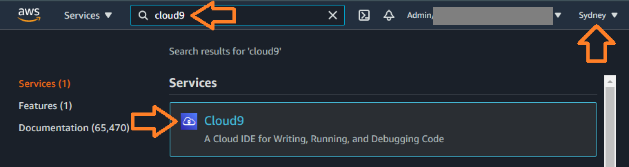
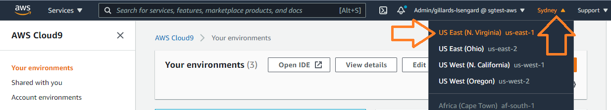
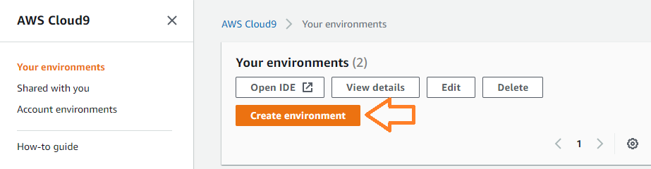
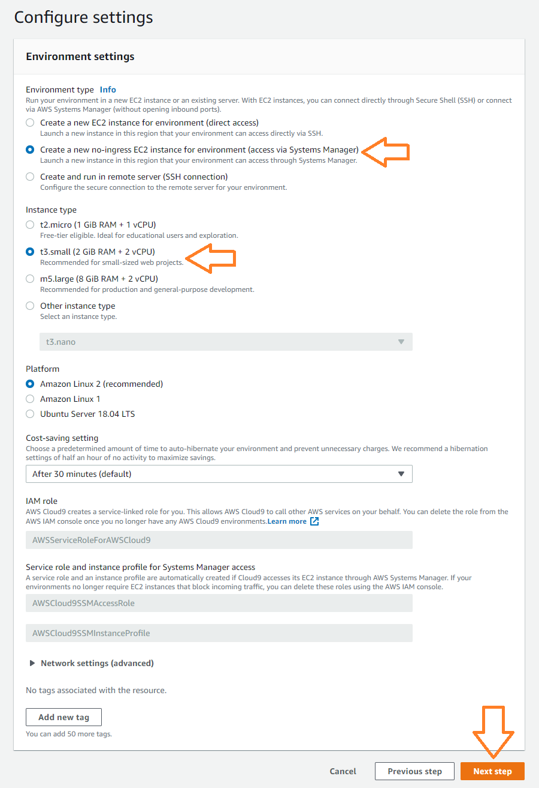
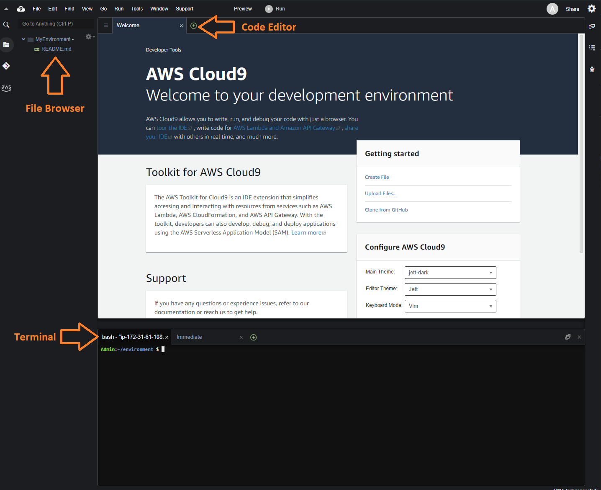

# Lab 1: Set up your AWS development environment
During this lab you will set up your cloud based development environment, that you will use to build your docker containers.

[AWS Cloud9](https://aws.amazon.com/cloud9/) is a cloud-based integrated development environment (IDE) that includes a managed Amazon EC2 instance, so you can write, run and debug applications with just a browser.  The instance will inherit your console privileges so you can use the AWS CLI or SDK without needing to manage credentials.

If you prefer you can use your own laptop or environment instead, and skip to [the prerequisites](#pre-requisites-for-your-own-environment).

## Set up AWS Cloud9 based development environment

1. Login to the [AWS Console](https://console.aws.amazon.com/cloud9/home) and navigate to the Cloud9 service. 

    

1. Select your preferred region.  The notebook we're using in this workshop leverages the ERA5 dataset from the AWS Open Data Registry, which is hosted in the `us-east-1` region.  Alternatively click on this link: https://console.aws.amazon.com/cloud9/home/product?region=us-east-1

    

1. Click on the **Create Environment** button, and give your environment a name

    

1. On the **Configure Settings** screen, select "Create a new no-ingress EC2 instance" and upgrade to a t3.small to give you a little more CPU power and memory than the default.  Leave everything else at default and click **Next step**.

    

1. Review the settings and click the **Create environment** button when you're ready to proceed.  Wait a minute or two and you should find yourself connected to your new development environment!

    

## Pre-requisites for your own environment
If you wish to use your own laptop or machine instead, make sure that the following pre-requisites are installed.  

**Note** AWS Cloud9 should have these pre-installed so you don't need to do anything if you've set up Cloud9 by following the steps above.

1. Install the AWS CLI: https://docs.aws.amazon.com/cli/latest/userguide/install-cliv2.html
1. Configure your CLI with credentials: https://docs.aws.amazon.com/cli/latest/userguide/cli-configure-quickstart.html
1. Install Docker: https://docs.docker.com/get-docker/
1. Install Git: https://git-scm.com/downloads

[Continue to Lab 2](workshop-02.md)