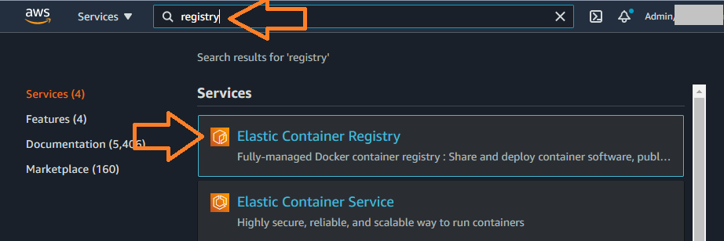
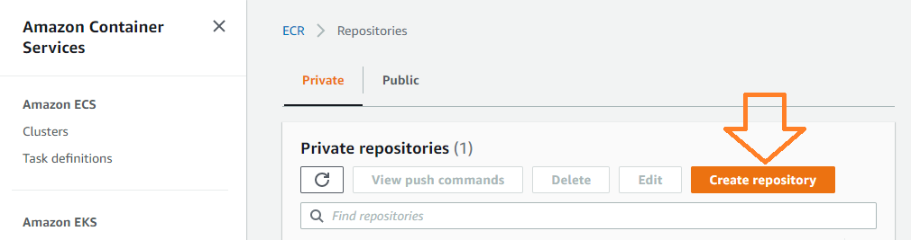
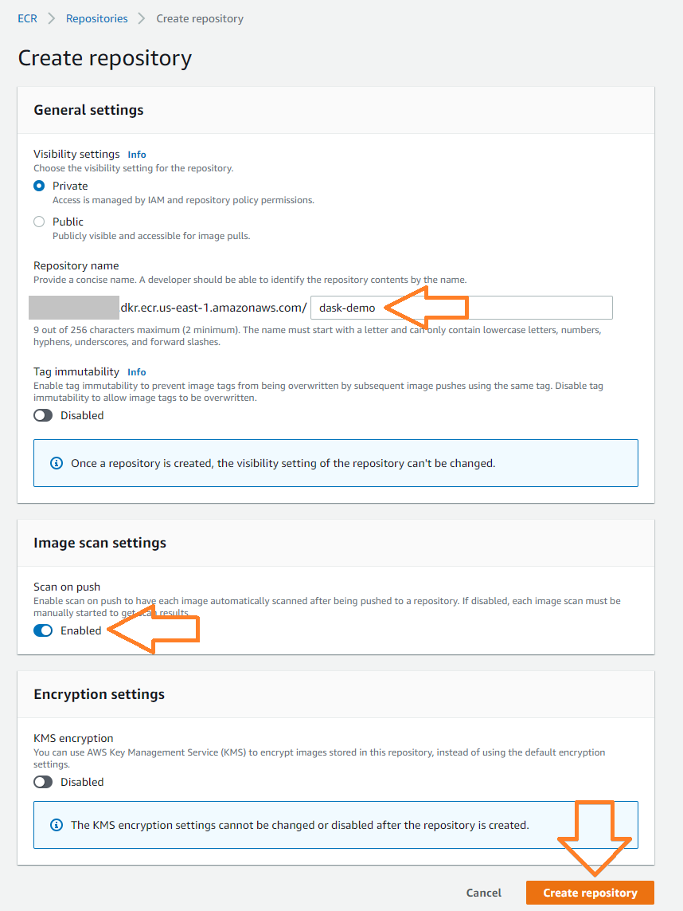
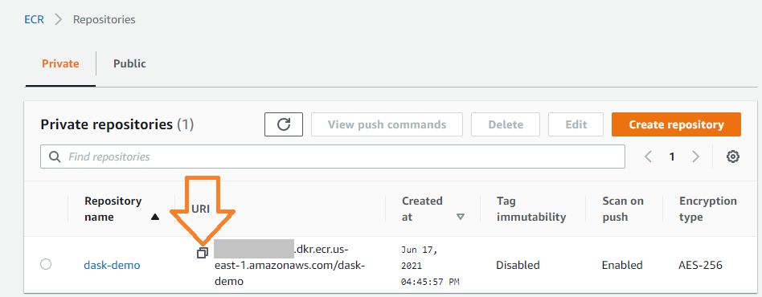
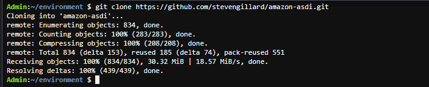
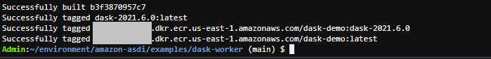
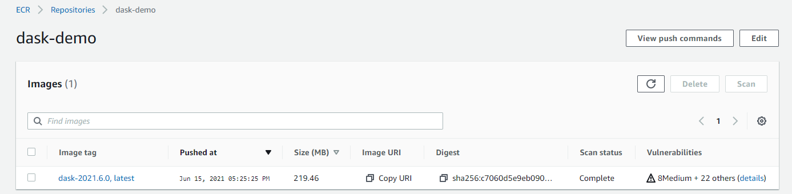

# Lab 2: Build your custom dask container image
This lab will step you through the process of building a container image and uploading it to the AWS Elastic Container Registry (ECR) service so that it can be deployed.

**Note** An auomated build pipeline is also available in [this CloudFormation template](cloudformation/dask-pipeline.yaml) if you wish to simplify the process and avoid the manual steps.  

## Create a new Container Repository
Switch back to your AWS console browser tab, or open a new tab and access the AWS console. 

1. In the AWS console, navigate to the **Elastic Container Registry** service or click the following link: https://console.aws.amazon.com/ecr/home

    

1. Click on the **Create Repository** button within the **Private** tab

    

1. On the settings page, enter a name for the repository and optionally enable **Scan on push**, which will warn you of any security issues inside your container image.  When you're ready, click **Create repository**.

    

1. Copy the URI of your newly created repository (by clicking the small icon as shown below), you will need it in the next section.

    

## Build the container image
Return to your development environment and perform the following steps.

1. Clone the git repository in the terminal window

    `git clone https://github.com/stevengillard/amazon-asdi.git`

    

1. Navigate to `amazon-asdi/examples/dask-worker` in the file browser and double click on the `Dockerfile` to open it in your IDE.  Read through the Dockerfile contents to understand how the container image is being built.  Note the following:
    * The container will be based on a [miniconda3](https://docs.conda.io/en/latest/miniconda.html) base container image from Red Hat quay.io. 
    * [Conda](https://docs.conda.io/en/latest/), an open source package manager common in data science environments, is being used to install software into the container.  You may prefer to use a different package manager in your environment.
    * Review the software packages and versions being deployed.  This Dockerfile installs:
        * Python 3.7.9
        * Dask and Dask Distributed
        * Various Python data processing modules that work with dask: pandas, numpy, xarray, zarr
        * Amazon S3 integration via the Python s3fs and fsspec modules
        * NetCDF file processing modules
    * There are two other files in the repository that will be copied into your image, `dask.yaml` which configures dask and `prepare.sh` which is a bootstrap script that provides a default entrypoint for your container.  Note that the entrypoint command will be overridden by our task definition during the next lab - we will run dask instead.

1. Set an environment variable for your container registry URI, using the value you copied in the previous section 

    `export ECR_URI=<acct>.dkr.ecr.us-east-1.amazonaws.com/dask-demo`

1. Change directories to the Dockerfile location

    `cd amazon-asdi/examples/dask-worker`

1. Build and tag the Docker image.  We'll tag it based on the version of dask being installed, as well as a `latest` tag for convenience.

    `docker build . -t dask-2021.6.0 -t ${ECR_URI}:dask-2021.6.0 -t ${ECR_URI}:latest`

1. The build process will take 5-10 minutes as all the software is downloaded and installed.  Monitor the process for errors.  With luck you'll see something like the following at the end of the output.

    

1. Once complete, you can push your newly built container image to your repository.  This requires that you "login" docker to the repository first.

    `aws ecr get-login-password | docker login --username AWS --password-stdin ${ECR_URI}`

1. Upload your container image to the repository

    `docker push -a ${ECR_URI}`

1. Return to the ECR service in the AWS console browser tab and check that you can see the image:

    

**Congratulations!**  You have successfully built a container image and installed the software packages necessary for analysing NetCDF data using python and dask.

It's common to automate the build process in a CI/CD pipeline.  An example of such a pipeline using the AWS CodePipeline and CodeBuild services can be found in [this CloudFormation template](cloudformation/dask-pipeline.yaml), which creates a CodeBuild process containing the steps you performed above.  This is executed any time there is a change to the source repository that is specified in the parameters.

For now though it's time to build the dask environment in [Lab 3](workshop-03.md).  