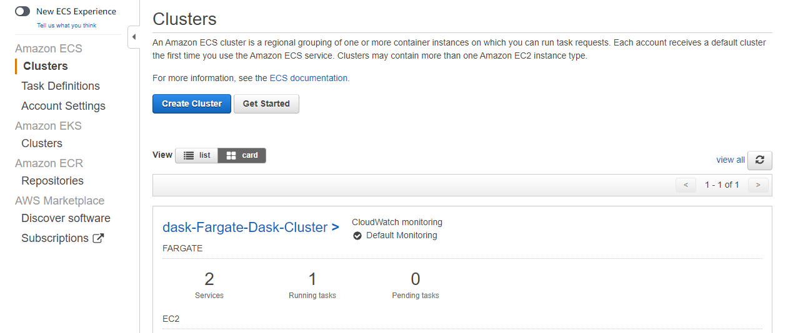
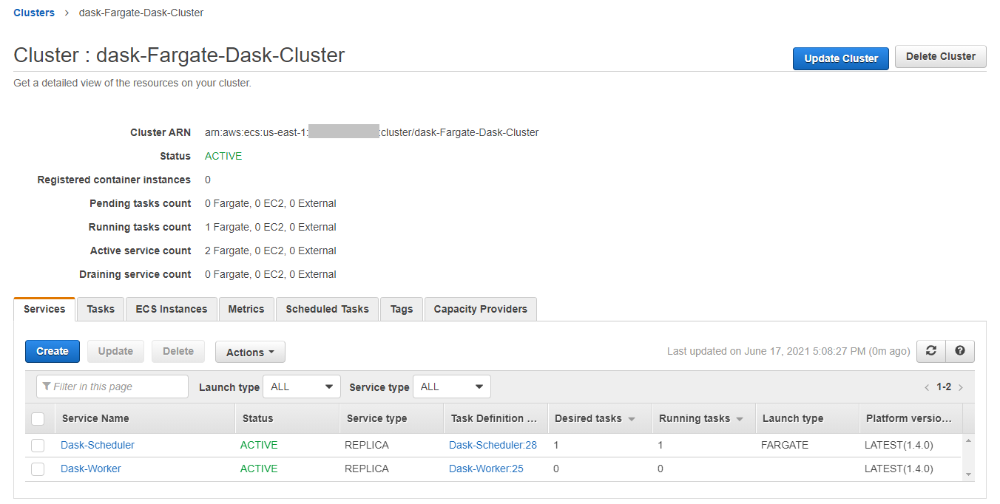

# Lab 3: Build the dask infrastructure
In this lab, we will spin up the infrastructure resources necessary to run our dask container in distributed mode.  This includes:
 * A Virtual Private Cloud with a public and private subnet
 * Internet Gateway, NAT Gateway and S3 endpoint resources to facilitate connectivity in and out of the VPC
 * Security Groups with ingress rules to control traffic
 * An Elastic Container Service cluster
 * Task definitions for the dask scheduler and dask workers
 * A SageMaker Notebook instance, connected to the VPC

We'll use a CloudFormation template to deploy these resources, as setting everything up through the AWS console will be time consuming and error-prone - using an infrastructure as code tool is a much better approach!

The CloudFormation template can be found [here](cloudformation/dask-environment.yaml) if you wish to review the contents.

## Deploy the CloudFormation template
We'll use the AWS console to deploy the template, but it can be done via the CLI if you prefer.

1. Navigate to the AWS CloudFormation page in the AWS console (or click [here](https://console.aws.amazon.com/cloudformation/home))

    

1. Click **Create Stack** and select **with new resources**

    

1. Select **Template is ready** and **Upload a template file**

1. Navigate to the location of the `dask-environment.yaml` file and select it (if using Cloud9 you may need to download the file to your computer first - simply right click and select **Download**).  The file will be uploaded to S3 automatically, and the location will appear.  Click **Next** when ready.

    

1. Enter a name for the stack, and change the `DaskImage` parameter value to your custom image URI (which you created in the previous step). Click **Next** when ready. 

    

1. There is nothing to change on the **Stack Options** screen - click **Next** again

1. On the **Review** screen double check all of the parameter values, and click the checkbox to acknowledge that CloudFormation will create IAM resources, then click **Create Stack**

    

1. Monitor the stack creation events and wait until the stack enters the **CREATE_COMPLETE** state.  This will take around 10 minutes.

    

## Check your dask services in the AWS ECS console
Once the CloudFormation stack has finished deployment, you can take a closer look at the container definitions, which are defined as services within Amazon Elastic Container Service (ECS).

1. Navigate to the Elastic Container Service in the AWS console, or click here: https://console.aws.amazon.com/ecs/home?region=us-east-1#

    

1. You should see your cluster, with two services and a single task running (the `dask-scheduler`)

    

1. Click on the cluster name to view more details about the services and tasks that are running.  At this stage there are no workers running, because we aren't ready for them yet.  We'll start them from within our notebook when we're ready to do some actual processing - otherwise they'll be running with nothing to do, costing money.

    

## Congratulations!
It's time to start using your dask environment!  Head to [lab 4](workshop-04.md) to begin.