# Lab 4: Run dask jobs via a SageMaker Notebook
The CloudFormation stack you created in the previous lab also deployed an Amazon SageMaker Notebook instance, which you can use to run python code against your dask environment.

This lab will get you connected to the notebook so you can access the dask environment.

## Access your SageMaker Notebook
1. Navigate to the Amazon SageMaker service in the AWS console (or click [here](https://console.aws.amazon.com/sagemaker/home))

    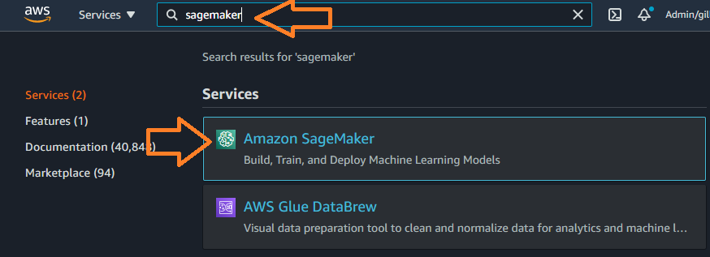

1. In the left-hand menu, expand the sub-menu under **Notebook** and click on **Notebook instances**

    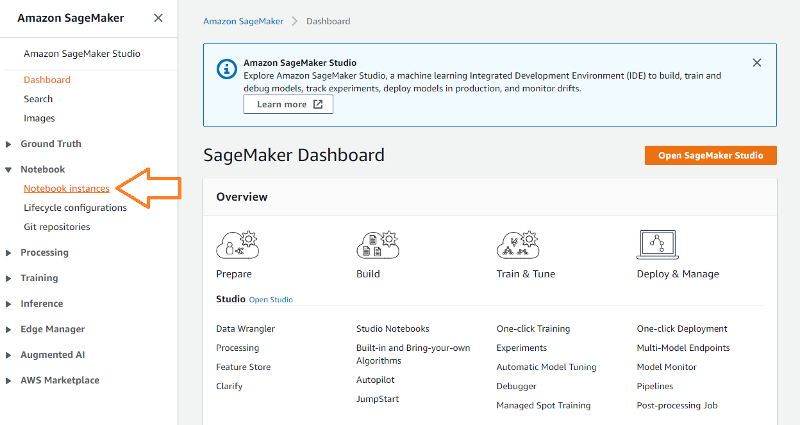

1. Click on the **Open JupyterLab** action link in the right hand column of the table

    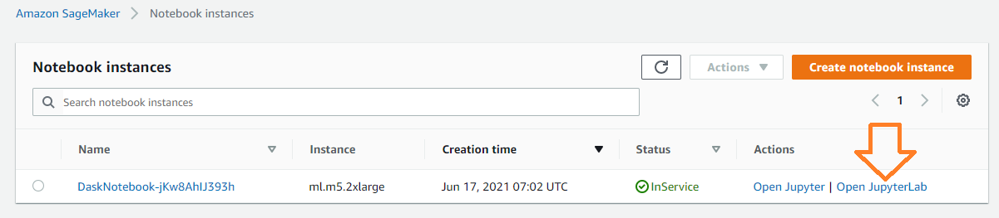

1. After a few seconds you should be redirected to the JupyterHub main screen, which has been pre-loaded with the dask software and a clone of the amazon-asdi GitHub repository:

    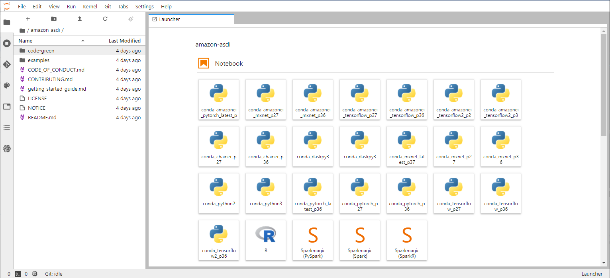

## Run the ERA5 notebook 
1. In JupyterHub, navigate to the `amazon-asdi/examples/dask/notebooks` folder.  Double click on the **era5-workshop.pynb** notebook file to open it.

    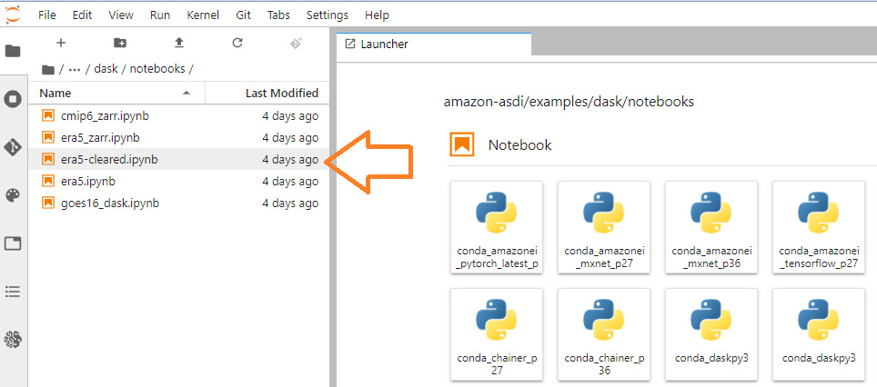

1. Make sure that the `conda_daskpy3` kernel is selected.  If not, change the kernel and select it.

    **Note** this kernel is re-created every time you start the SageMaker notebook instance, and can take up to 10 minutes.  You can open a terminal from within JupyterLab and monitor progress with `tail output.log`.

    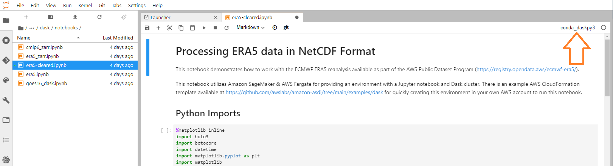

1. You can now execute each cell in the notebook by clicking the triangular "play" button.  Output from each cell (if there is any) will appear below.  Wait until the number appears on the square brackets before continuing.

    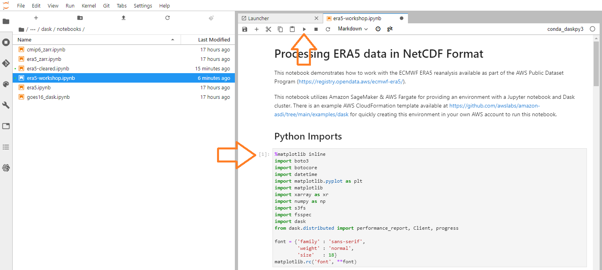

1. During the early steps you'll start the scheduler (which may be running already).  This step will also display some information about your cluster, including the external URL of the scheduler dashboard.  Click on the scheduler URL to open it in another browser tab.  Make sure you can access it.

    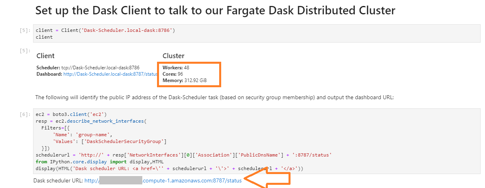

1. You'll scale out the number of dask cluster workers.  By default the notebook creates 48 Fargate tasks.  You'll want to shut these down if you decide not to finish with the notebook - for that you'll need to skip to the step at the end.

    

1. This step will take a few minutes.  In the meantime return to the dashboard tab and click on the **Workers** tab to see your workers starting.  There won't be much happening for now, but we'll switch back to this page later.

    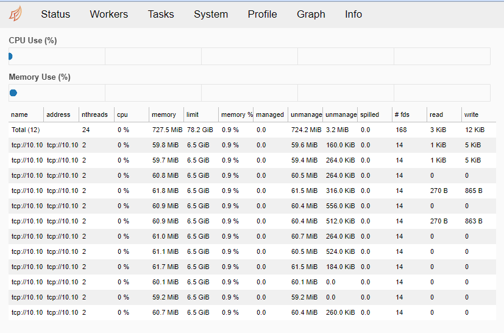

1. Return to your notebook instance tab and continue executing the steps.  You'll be taken through a series of introductory operations, opening files, loading datasets and displaying some information about the objects.  When you reach the `client.persist()` step, your dask tasks will being execution.  The first one of these loads all data into dask worker memory, as explained in the notebook.

    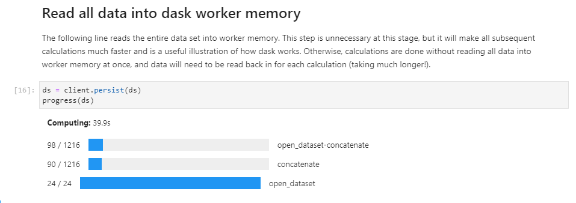

1. While this cell is executing, switch to the dask daskboard and monitor the task progress

    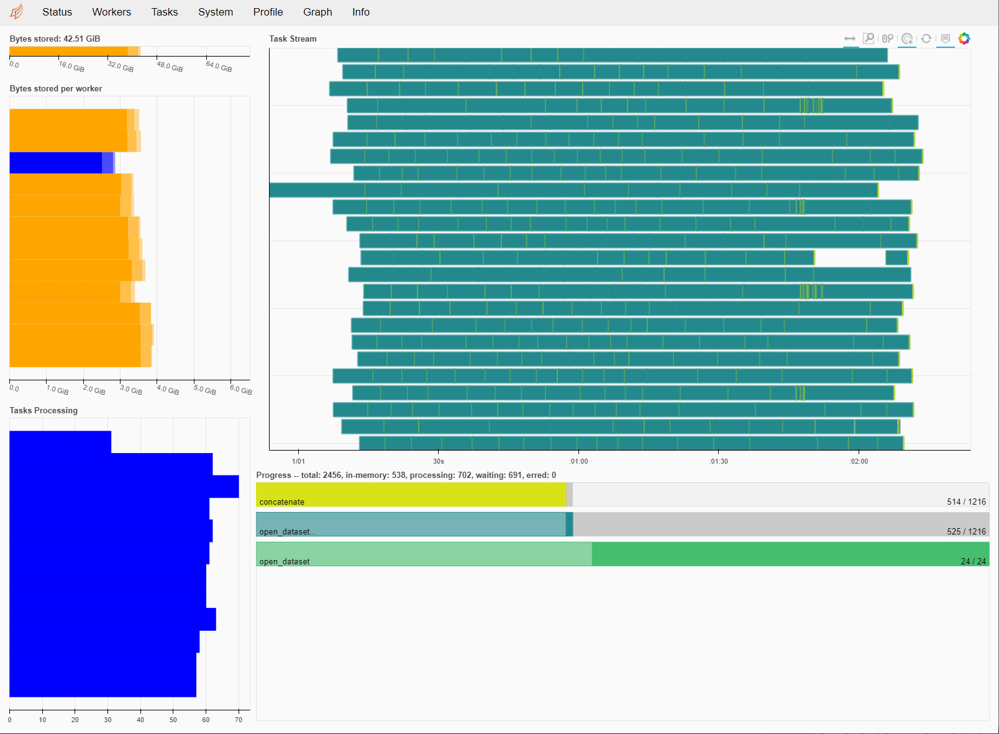

    The task will take 4-5 minutes to complete.

1. Once data is loaded, the notebook will guide you through a number of calculations on the data, including:
    * Conversion of the temperature units from K to C (a simple substraction - but over **54 billion** calculations!)
    * Calculation of the mean and standard deviation of temperature for every point
    * Extraction of time series data for specific points into a table format and plotted as a line graph

    Below are some of the screenshots.

    Mean calculation

    

    Plot of the average temperature
 
    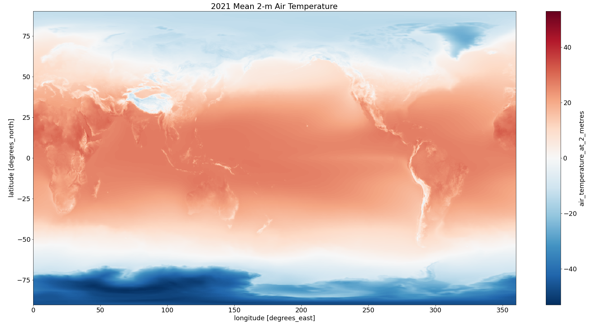

    Plot of the standard deviation

    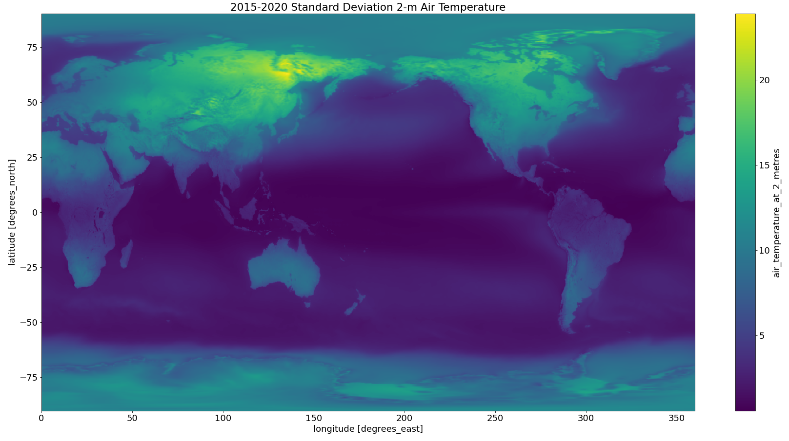

    Line plot of temperatures in specific locations

    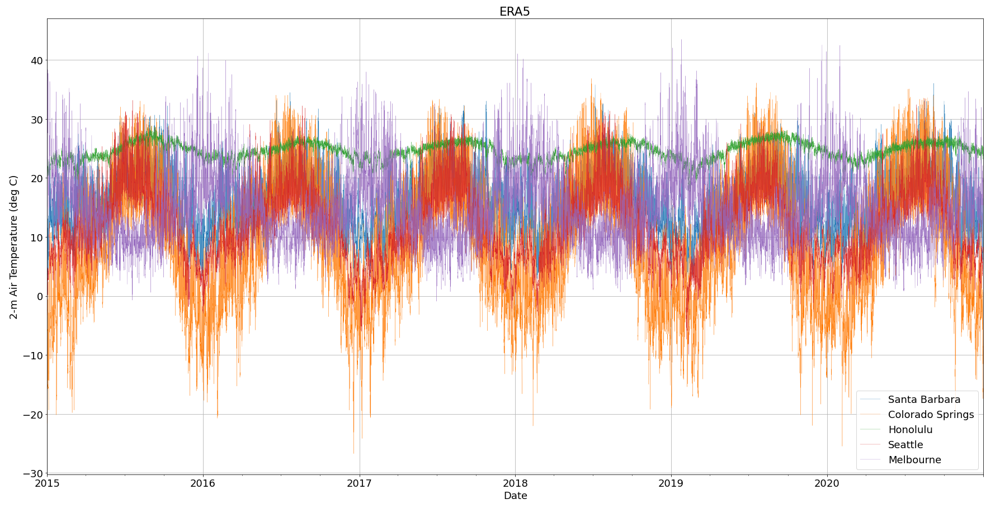

1. As an additional exercise, try increasing the number of workers in the cluster to 72 and repeating the calculations - how much faster do they run?  You can restart the notebook by selecting **Kernel** -> **Restart Kernel and Clear All Outputs** from the JupyterHub menu bar.

    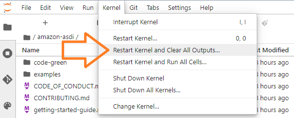

## Clean-up
When you're finished, make sure you shut down the resources to avoid incurring costs.

Refer to the steps [here](workshop-05.md)