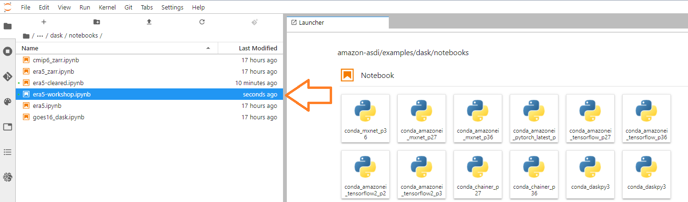
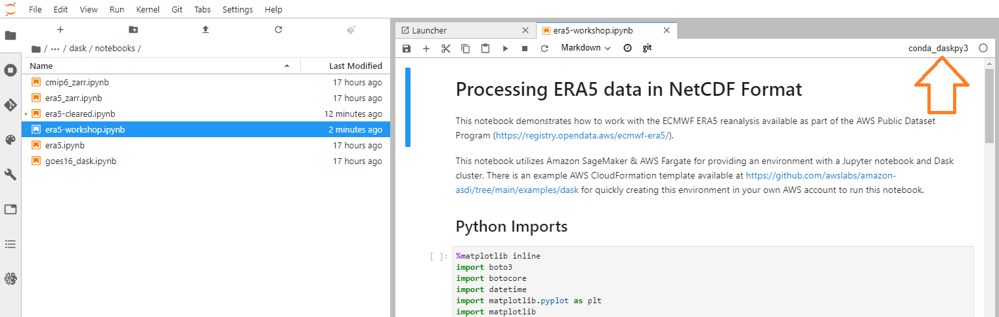
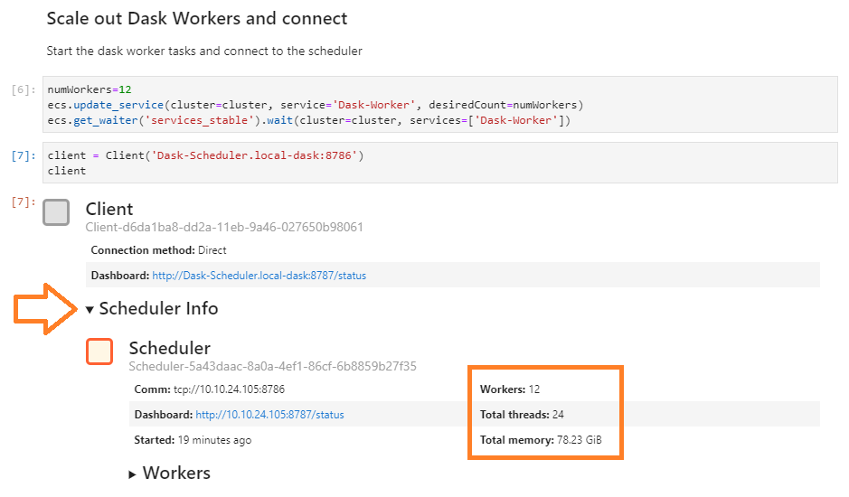
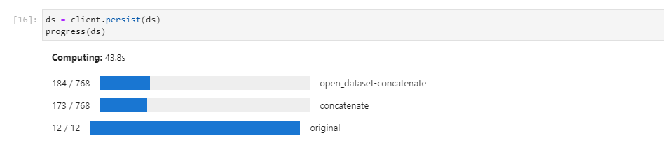

# Lab 4: Run dask jobs via a SageMaker Notebook
The CloudFormation stack you created in the previous lab also deployed an Amazon SageMaker Notebook instance, which you can use to run python code against your dask environment.

This lab will get you connected to the notebook so you can access the dask environment.

## Access your SageMaker Notebook
1. Navigate to the Amazon SageMaker service in the AWS console (or click [here](https://console.aws.amazon.com/sagemaker/home))

    

1. In the left-hand menu, expand the sub-menu under **Notebook** and click on **Notebook instances**

    

1. Click on the **Open JupyterLab** action link in the right hand column of the table

    

1. After a few seconds you should be redirected to the JupyterHub main screen, which has been pre-loaded with the dask software and a clone of the amazon-asdi GitHub repository:

    

## Run the ERA5 notebook 
1. In JupyterHub, navigate to the `amazon-asdi/examples/dask/notebooks` folder.  Double click on the **era5-cleared.pynb** notebook file to open it.

    

1. Make sure that the `conda_daskpy3` kernel is selected.  If not, change the kernel and select it.

    

1. You can now execute each cell in the notebook by clicking the triangular "play" button.  Output from each cell (if there is any) will appear below.  Wait until the number appears on the square brackets before continuing.

    

1. Pay attention to the text on each cell and follow what it says.  In the 3rd step you'll scale out the number of dask cluster workers.  By default the notebook creates 48 Fargate tasks.  You'll want to shut these down if you decide not to finish with the notebook - for that you'll need to skip to the step at the end.

    

1. The scale out will take a minute or two.  The next two steps will display some information about your cluster, as well as the external URL of the dask scheduler.  Click on the scheduler URL and open it in another browser tab.

    

1. Make sure you can access the dask scheduler.  Click on the **Workers** tab to see your 48 workers.  There won't be much happening for now, but we'll switch back to this page later.

    

1. Return to your notebook instance tab and continue executing the steps.  You'll be taken through a series of introductory operations, opening files, loading datasets and displaying some information about the objects.  When you reach the `temp_mean.persist()` step, your dask tasks will being execution.

    

1. While this cell is executing, switch to the dask daskboard and monitor the task progress

    

    The task will take 4-5 minutes to complete.

1. Once complete, the next step will display a plot of the mean temperature for all points

    