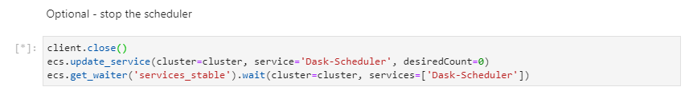

# Clean-up
When you're finished, make sure you shut down the resources to avoid incurring costs.

## Temporary Shutdown
If you plan to use the environment again later, you can leave the resources in place but simply turn them off.

1. Execute the final step in the Jupyter notebook, which shuts down the work tasks:

    

1. Optionally, stop the dask scheduler task.  The dask client will throw an exception, but this is expected.  If you want to restart the scheduler later simply change `desiredCount=1` in this cell and re-run it (**Note** this can also be done through the AWS ECS console):

    

1. Stop the SageMaker Notebook instance through the AWS SageMaker console (it can be restarted again later if you wish to re-use the environment, but remember to give it 10min for the lifecycle configuration to take place):

    

## Complete removal
If you wish to completely remove all resources, perform the following steps:

1. Delete the AWS CloudFormation stack through the AWS console.  This will completely remove your ECS cluster, SageMaker notebook instance and the VPC networking components.

    

1. Delete your container images from the AWS Elastic Container Repository (ECR) console.

    

1. Delete your AWS Cloud9 environment through the AWS Cloud9 console.

    